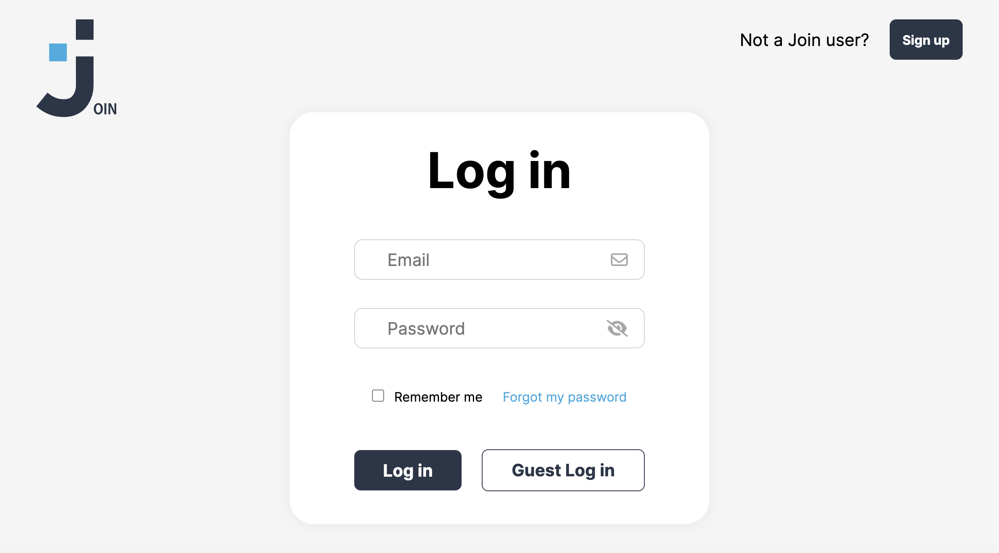
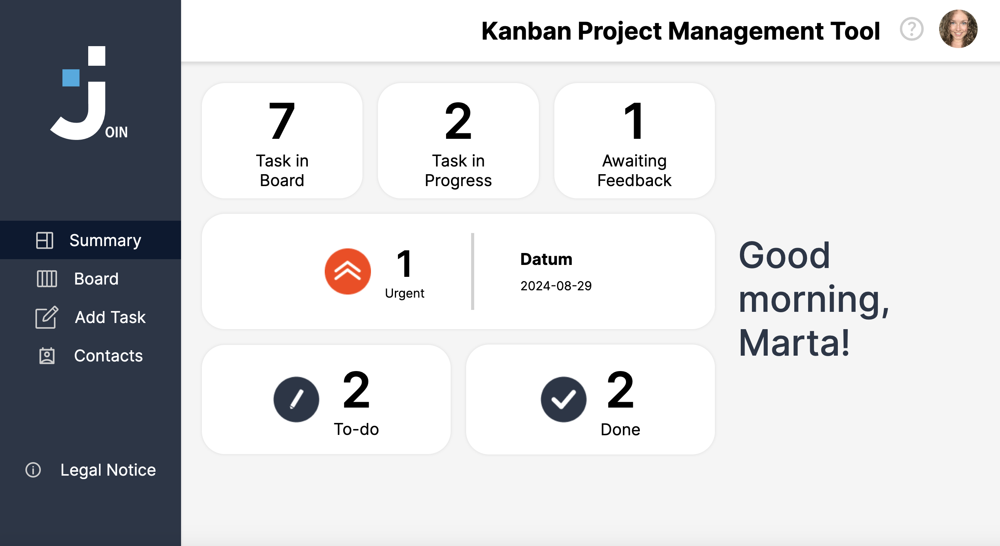
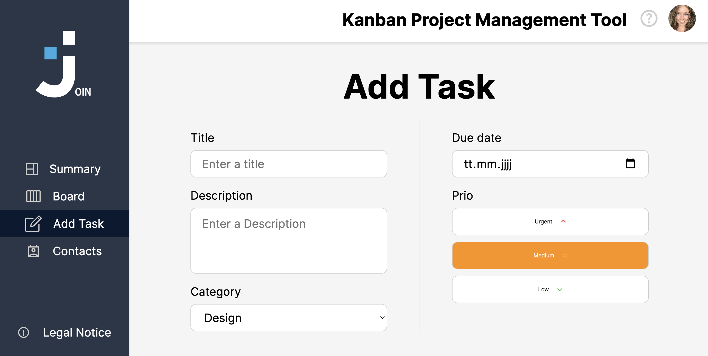
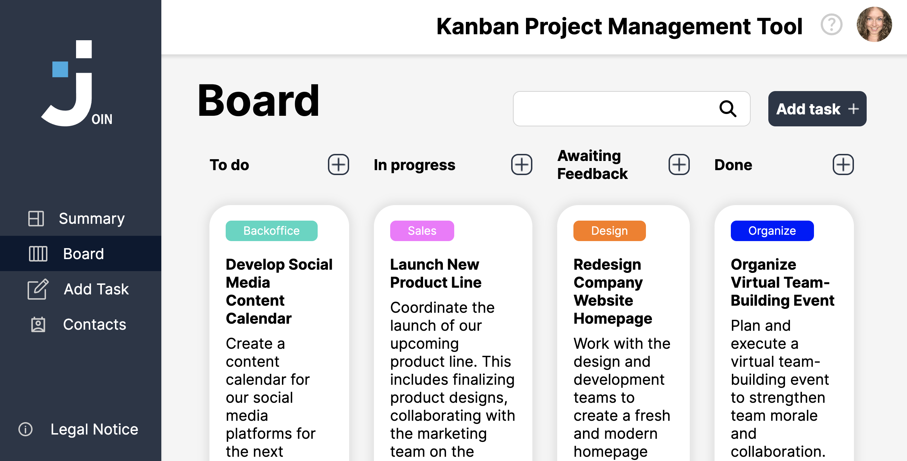
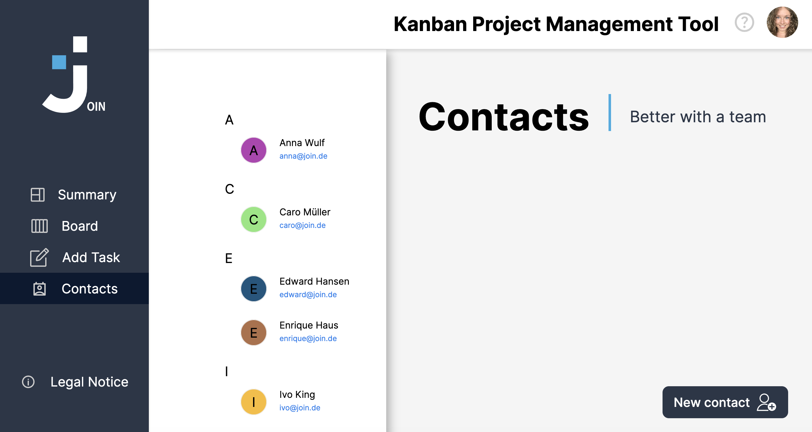
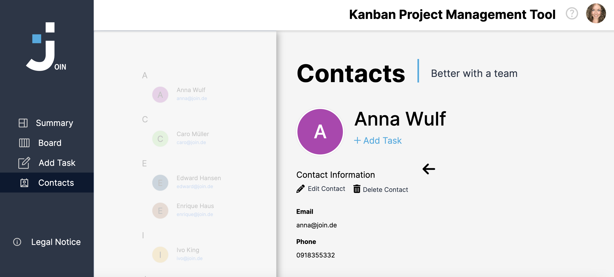

# Join24

Join24 is a task management tool that helps you organize, assign, and track tasks efficiently. It provides an overview of your tasks, allows you to create and manage tasks, and includes a contact management system.

## Features

### Login

### Summary
- **Overview of Tasks**: Displays a quick summary of your tasks, allowing you to see an overview of what needs to be done.

### Add Task
- **Create Tasks**: Easily create new tasks and assign them to one or more users.
- **Category Selection**: Choose the appropriate category for each task.
- **Set Priority**: Assign a priority level to tasks to indicate their importance.

### Board
- **Task Organization**: View all tasks ordered by category.
- **Drag & Drop**: Move tasks between different statuses (e.g., To Do, In Progress, Done) using a simple drag-and-drop interface.

### Contacts
- **Contact Management**: Manage a list of your personal contacts.
- **Add New Contacts**: Easily add new contacts to your list.
- **Delete Contacts**: Remove contacts from your list as needed.

